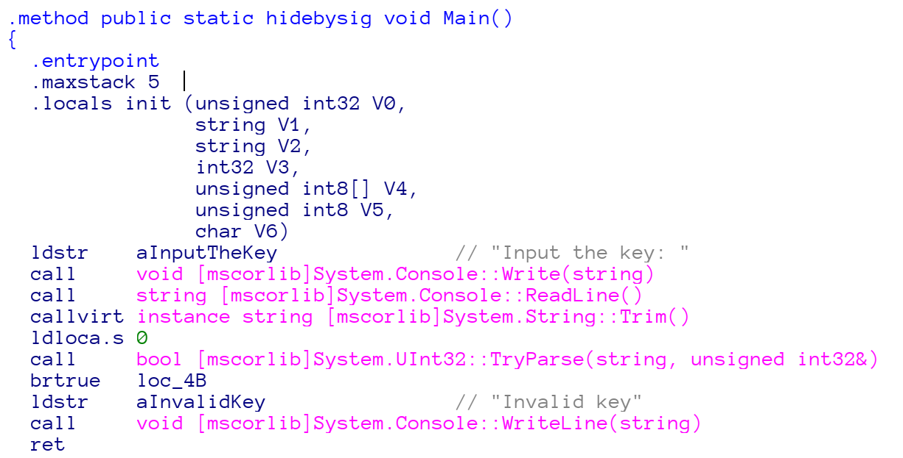

# GCCC

We are given a binary [gccc.exe](./gccc.exe). I tried to disassemble it in IDA, and found some instructions.  After googling, I found that this binary is written in `.NET`.

The decompiler I used is [AvaloniaILSpy](https://github.com/icsharpcode/AvaloniaILSpy), the result is available [here](./reversed)

The code is simple..., but seems hard to write a script to reverse it! 

The hint says we can try some **z3 magic**. [Z3](https://github.com/Z3Prover/z3) is a theorem prover from Microsoft Research. By given some statements, Z3 can help us verify if the statements are `sat` or `unsat`. If the result is `sat`, which means satisfied, that means we can derive a possible solution to the given statements!

Since I am not familiar with Z3-Prover, it takes me some time to write the script.

For a beginner (like me), I suggest some basic usage that one must know:

Normal usage:
* `solver = Solver()` to create a solver
* `solver.add(statement)` to add a statement
* `solver.model()` to get the model if `sat`

Debugging:
* `solver.set(unsat_core=True)` to set up unsat reason 
* `solver.assert_and_track(statement, name)` to track a statement
* `solver.unsat_core()` to read the actual unsat reasons (Type array)

More reference can be found at
* [Z3一把梭：用约束求解搞定一类CTF题](https://zhuanlan.zhihu.com/p/30548907)
* [Z3 API in Python](http://scungao.github.io/mit-iap17/z3python.html)
* [z3py Namespace Reference](https://z3prover.github.io/api/html/namespacez3py.html#ada058544efbae7608acaef3233aa4422)
