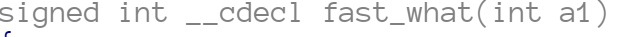

## what-the-hell

先跑看看程式有什麼輸出

似乎是要我們輸入一組 key。

再看一下看一下程式碼 decompile 出來有什麼東西

程式碼其實蠻好讀的，一開始程式碼要我們輸入一組 key，驗證的部份看起來是在 `calc_key3` 裏面。

這邊有很多式子要滿足，看起來挺複雜的，用 z3 解解看，腳本在 `solve.py` 裏面。
（`what` 函式看起來就是會回傳 fibonacci number, 但是我在 `solve.py` 裏面沒有驗證，因為 output 只有兩個都放進去看看就知道了哈哈）。

需要特別注意的是，fibonacci sequence 一直遞增下去會 overflow，所以 `what(i) == a1` 這邊事實上是要比較 overflow 過後的值。如果在 python 上驗證可能要用 numpy 之類讓他 overflow 才可以算。

解完之後就可以得到輸入的 a1, a2 以及 `calc_key3` 的回傳值了。

把這 3 個值代入 `decrypt_flag` 就可以了。
因為發現原本的程式裏面還有一個 fast fibonnaci function (`fast what`)，所以比較省事的方法是把原本的 binary 中呼叫 `what()` 的地方 patch 成 `fast_what()`

patch 完的結果我存在 `what-the-hell-fast` 裏面，使用得到的 key `4284256177-1234567890` 算出 flag。

